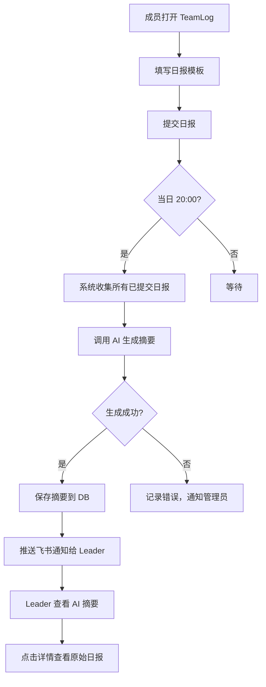

# PRD：TeamLog 团队日报助手 V1

> 使用 Skill：[04_prd-generation](../skills/04_prd-generation.md)
> 日期：2025-04-25
> 本文为精简示例，仅展示 PRD 结构和关键章节节选

---

## 1. 文档信息

| 字段 | 内容 |
|------|------|
| 版本号 | V1.0 |
| 创建日期 | 2025-04-25 |
| 作者 | PM |
| 状态 | 草稿 |

---

## 2. 项目概述

- **项目背景**：中小技术团队普遍使用飞书/钉钉群发日报，管理者需逐条阅读并手动汇总，每天耗时 30-60 分钟。TeamLog 通过 AI 自动汇总团队日报，生成结构化进展摘要和风险预警。
- **目标用户**：10-50 人技术团队的 Leader 和一线开发者
- **核心价值主张**：AI 自动汇总团队日报，让管理者 30 秒掌握团队状态
- **目标平台**：Web（一期）
- **成功指标**：
  - 上线 3 个月内服务 50 个团队
  - Leader 日均日报处理时间从 30 分钟降至 5 分钟
  - 日报提交率 ≥ 80%

---

## 3. 用户角色与权限矩阵

| 角色 | 描述 | 可访问模块 | 核心操作权限 | 数据范围 |
|------|------|-----------|-------------|---------|
| 超级管理员 | 团队创建者 | 全部 | 全部 CRUD + 团队设置 + 成员管理 | 全团队 |
| 团队成员 | 普通开发者 | 日报填写、个人历史 | 自己的日报 CRUD | 仅个人 |

---

## 4. 信息架构

```
├── 首页（AI 汇总看板）
│   ├── 今日 AI 摘要
│   ├── 阻塞项列表
│   └── 团队进度概览
├── 日报
│   ├── 填写日报
│   ├── 我的日报历史
│   └── 团队日报列表
├── 看板
│   ├── 按人员维度
│   └── 按项目维度
└── 设置
    ├── 团队管理
    ├── 通知设置
    └── 个人信息
```

---

## 5. 功能需求清单（节选）

**模块缩写定义**：

| 模块名称 | 缩写 |
|---------|------|
| 用户中心 | UC |
| 日报管理 | DR |
| AI 汇总 | AS |
| 通知推送 | NT |

### 模块：日报管理（DR）

| 编号 | 功能名称 | 优先级 | 用户故事 | 验收标准 |
|------|---------|--------|---------|---------|
| DR-001 | 结构化日报填写 | P0 | 作为开发者，我想用结构化模板填写日报，以便快速完成日报 | ① 提供"今日完成/明日计划/阻塞问题"三段式模板 ② 支持 Markdown 格式 ③ 每个字段最大 2000 字 ④ 自动保存草稿（每 30 秒） |
| DR-002 | 日报提交与编辑 | P0 | 作为开发者，我想提交日报后仍可修改，以便补充遗漏 | ① 当日 24:00 前可编辑已提交日报 ② 编辑后标记"已修改"并记录修改时间 ③ 每日仅允许提交一份日报 |
| DR-003 | 团队日报列表 | P0 | 作为 Leader，我想查看团队所有成员的日报，以便了解详情 | ① 按日期倒序展示 ② 支持按成员筛选 ③ 未提交成员标灰显示 ④ 默认展示今日，可切换历史日期 |

### 模块：AI 汇总（AS）

| 编号 | 功能名称 | 优先级 | 用户故事 | 验收标准 |
|------|---------|--------|---------|---------|
| AS-001 | 每日 AI 摘要生成 | P0 | 作为 Leader，我想看到 AI 自动生成的团队日报摘要 | ① 每日 20:00 自动触发 ② 摘要包含：关键进展（≤5 条）、阻塞项（标红）、风险预警 ③ 如当日提交率 < 50%，摘要顶部标注"数据不完整" ④ 生成耗时 ≤ 30 秒 |
| AS-002 | 摘要查看与历史 | P1 | 作为 Leader，我想查看历史 AI 摘要，以便回顾团队趋势 | ① 按日期倒序展示历史摘要 ② 支持按周查看摘要合集 |

---

## 6. 核心业务流程图



---

## 7. 数据模型设计（节选）

| 实体名 | 字段名 | 字段类型 | 是否必填 | 说明 |
|--------|--------|---------|---------|------|
| User | id | bigint | 是 | 主键，自增 |
| User | name | varchar(50) | 是 | 用户姓名 |
| User | email | varchar(100) | 是 | 邮箱，唯一索引 |
| User | role | enum('admin','member') | 是 | 角色 |
| DailyReport | id | bigint | 是 | 主键，自增 |
| DailyReport | user_id | bigint | 是 | 外键 → User.id |
| DailyReport | report_date | date | 是 | 日报日期，与 user_id 联合唯一 |
| DailyReport | completed | text | 否 | 今日完成 |
| DailyReport | planned | text | 否 | 明日计划 |
| DailyReport | blockers | text | 否 | 阻塞问题 |
| DailyReport | status | enum('draft','submitted') | 是 | 日报状态 |
| AISummary | id | bigint | 是 | 主键，自增 |
| AISummary | team_id | bigint | 是 | 外键 → Team.id |
| AISummary | summary_date | date | 是 | 汇总日期，与 team_id 联合唯一 |
| AISummary | content | text | 是 | AI 生成的摘要内容 |
| AISummary | report_count | int | 是 | 参与汇总的日报数量 |

实体关系：
- User N:1 Team（一个用户属于一个团队）
- User 1:N DailyReport（一个用户有多条日报）
- Team 1:N AISummary（一个团队有多条 AI 摘要）

---

## 8. 接口设计（节选）

### 日报模块

| 方法 | 路径 | 说明 | 鉴权 |
|------|------|------|------|
| POST | /api/reports | 提交/保存日报 | Bearer Token |
| GET | /api/reports?date=2025-04-25 | 获取团队当日日报列表 | Bearer Token |
| PUT | /api/reports/:id | 编辑已提交日报 | Bearer Token（仅本人） |

### AI 汇总模块

| 方法 | 路径 | 说明 | 鉴权 |
|------|------|------|------|
| GET | /api/summaries?date=2025-04-25 | 获取当日 AI 摘要 | Bearer Token（仅管理员） |
| GET | /api/summaries | 获取历史摘要列表 | Bearer Token（仅管理员） |

---

## 12. 迭代规划

| 阶段 | 范围 | 包含模块 | 预计工时 |
|------|------|---------|---------|
| 一期 | MVP 核心闭环 | UC、DR、AS、NT | 30 人天 |
| 二期 | 体验增强 | 进度看板增强、Git 集成、周报生成、钉钉适配 | 20 人天 |

---

## 自检报告

- ✅ 实施方案中每个一期模块均有对应功能需求章节
- ✅ 所有功能均有验收标准，且可测试、可量化
- ✅ 功能编号连续，无重复、无跳号
- ✅ 数据模型覆盖所有核心实体
- ✅ 接口设计覆盖所有前后端交互场景
- ✅ 用户角色权限矩阵覆盖所有功能的访问控制
- ✅ 非功能性需求均有量化指标（完整版中）
- ✅ 术语和命名全文一致
- ✅ P0 功能构成完整业务闭环（日报填写 → AI 汇总 → 通知推送）
